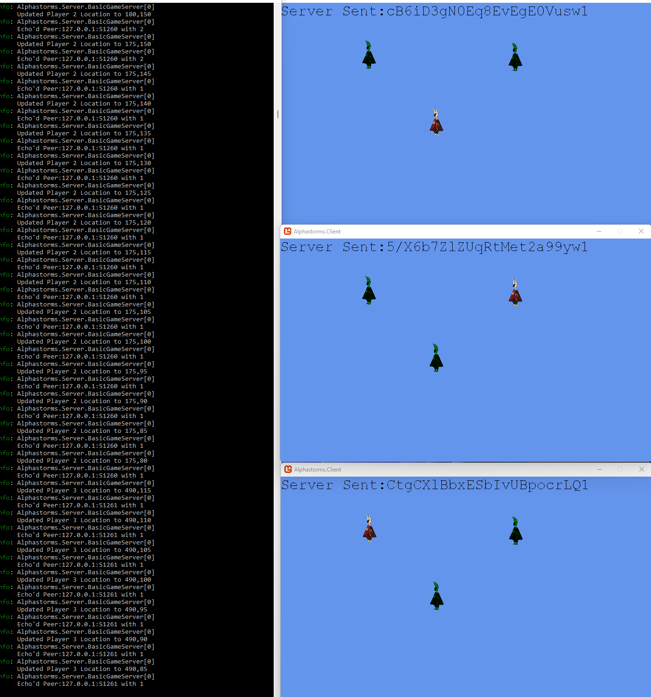

# Alphastorms
Alphastorms is a C# .NET 6.0 cross-platform MMO engine with a Monogame test client. 

## About the Author
As a former developer on MMO servers (Ultima Online shards, Shadowrun MMO [cancelled]), I've had a lifelong passion for creating online games and scaleable simulations. Between my dayjob as a Cloud Engineer and side job as a engineer for a massively parallel trading platform, I find that I'm always trying to force distributed and parallel computing into my projects. Alphastorms is my attempt to channel that energy into something that might be useful for the game dev commnunity. The engine is intended to be used to power a 2D front-end (which will be provided) powered by Monogame or any C# capable platform. In theory, a 3D client could be created but, I'm not a 3D dev so that's not my area of focus at the moment.

## Goal
The goal is to deliver a self-contained MMO engine with client and server powered by .NET 6.0 and easily run on any platform. Each release will contain the server, the client, any tools, data generation scripts for the datastore and any open-source or free-to-use-and-distribute assets used in the Client. 

It should ultimately be as simple as "dotnet alphastorms.server.dll" to start the server and "dotnet alphastorms.client.dll" to start the client. 

## Current State
Currently, you can run the server and spawn up to 4 clients (switchable in code). Moving any of the clients results in the others being updated. Clients other than "yourself" are represented as blue/green version of the "Robbit" main character. The current implementation is an initial test and will be improved upon. This is in keeping with our stated goal of "always having a playable release". 

# Alphastorms Components
## Alphastorms Downloader
The client side download tool used to download files and executables from the download server

## Alphastorms Website
This is the landing page for the game as well as where the downloader targets to authenticate and download the latest game version

## Alphastorms Client
This is the game client which is downloaded via the downloader and allows connection to the game server

## Alphastorms Server
This is the backend game server which processes commands from the game engine using a combination of TCP and UDP. 

## Alphastorms Shared
For now a collection of shared classes. In the future, we may have to break this shared dependency. Perhaps sooner rather than later. 

## Alphastorms Manifest Generator
This is a tool that generates a manifest based on the latest game client which includes zipping large files, zipping assets (or asset collections), generating thumbprints

## Alphastorms.Utility
This is a library for basic utilities that can be shared and are general enough that they can be shared across all the various tools.
This is NOT for models or client/server shared code/etc. It is only for basic OS utilities and primitives. 

# The General Dev Plan
> Every checkin should result in a playable release.
* Development of Client/Server to the point where there's a semi-stable "standard" of types that get serialized and delivered as well as frequency and protocol (configurable)
* Development of support tools to allow deployment of the server (i.e. the downloader and manifest gen)
* Development and Deployment of website with canonical implementation deployed either in process or in cloud nearby, along with hosting future docs and links to this repo. 
* A persistent server running once there's something worth showing where players can create accounts, login, and chat or play with other users

